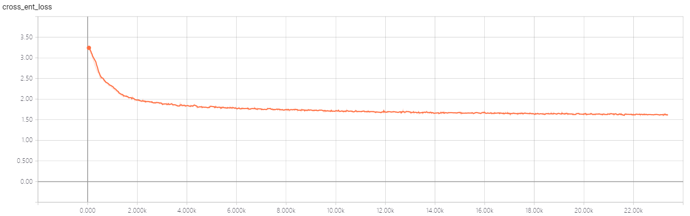
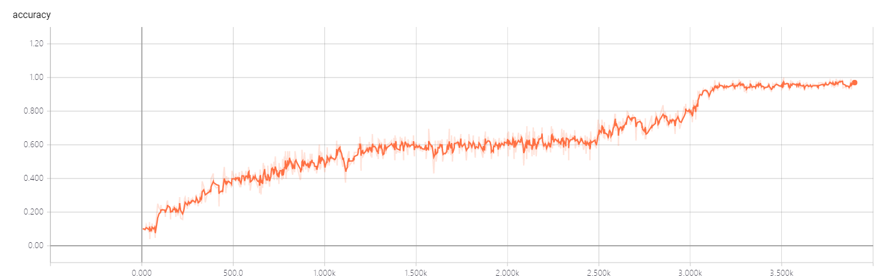

# MATRIX CAPSULES EM-Tensorflow

[](https://opensource.org/licenses/Apache-2.0)


A Tensorflow implementation of CapsNet based on paper [Matrix Capsules with EM Routing](https://openreview.net/pdf?id=HJWLfGWRb)

> **Status:**
> 1. With configuration A=32, B=8, C=16, D=16, batch_size=128, the code can work on a Tesla P40 GPU at a speed of 8s/iteration. The definitions of A-D can be referred to the paper.
> 2. With configuration A=B=C=D=32, batch_size=64, the code can work on a Tesla P40 GPU at a speed of 25s/iteration. More optimization on implementation structure is required.
> 3. Some modification and optimization is implemented to prompt the numerical stability of GMM. Specific explanations can be found in the code.
> 4. With configuration A=32, B=4, D=4, D=4, batch_size=128, each iteration of training takes around 0.6s on a Tesla P40 GPU.

> **Current Results on MNIST:**
- Configuration: A=32, B=8, C=16, D=16, batch_size=32, iteration number of EM routing: 2, with Coordinate Addition, loss

- Training loss. Some variations of training loss can be observed, however test accuracy is stable.


- Test accuracy(current best result is 99.1%)


> **Ablation Study:**
- Configuration: A=32, B=4, C=4, D=4, batch_size=128, iteration number of EM routing: 2, no Coordinate Addition, cross entropy loss, test accuracy is 96.4%.
- Configuration: A=32, B=4, C=4, D=4, batch_size=128, iteration number of EM routing: 2, with Coordinate Addition, cross entropy loss

> **To Do List:**
> 1. Experiments on smallNORB as in paper is about to be casted.

Any questions and comments to the code and the original algorithms are welcomed!!! My email: zhangsuofei at njupt.edu.cn

## Requirements
- Python >= 3.4
- Numpy
- Tensorflow >= 1.2.0

## Usage
**Step 1.**
Clone this repository with ``git``.

```
$ git clone https://github.com/www0wwwjs1/Matrix-Capsules-EM-Tensorflow.git
$ cd Matrix-Capsules-EM-Tensorflow
```

**Step 2.**
Download the [MNIST dataset](http://yann.lecun.com/exdb/mnist/), ``mv`` and extract it into ``data/mnist`` directory.(Be careful the backslash appeared around the curly braces when you copy the ``wget `` command to your terminal, remove it)

```
$ mkdir -p data/mnist
$ wget -c -P data/mnist http://yann.lecun.com/exdb/mnist/{train-images-idx3-ubyte.gz,train-labels-idx1-ubyte.gz,t10k-images-idx3-ubyte.gz,t10k-labels-idx1-ubyte.gz}
$ gunzip data/mnist/*.gz
```

**Step 3.**
Start the training(MNIST):
```
$ python3 train_mnist.py
```

**Step 4.**
View the status of training:
```
$ tensorboard --logdir=./logdir
``` 
Open a chrome browser, visit the site: http://127.0.0.1:6006/

**Step 5.**
Start the test on MNIST:
```
$ python3 eval_mnist.py
```

**Step 6.**
View the status of test:
```
$ tensorboard --logdir=./test_logdir
```
Open a chrome browser, visit the site: http://127.0.0.1:6006/

### Reference
- [naturomics/CapsNet-Tensorflow](https://github.com/naturomics/CapsNet-Tensorflow): the implementation of Hinton's paper [Dynamic Routing Between Capsules](https://arxiv.org/abs/1710.09829)
